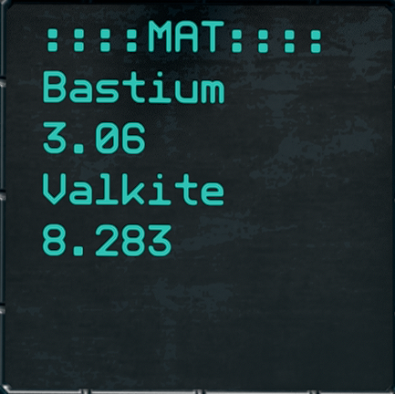

# Material Point Scanner

Scans constantly until it finds a result (or you release the button).

Shows ore contents in **stacks**.

Reads the ores in the opposite way, so you always have the core material first.



## Usage
### Naming
```
-- Button --
    Name = Scan
    Type = 1
```
```
-- Screen --
    Name = ::::MAT:::
```
```
-- Material Point Scanner --
    Active = Scan
    Index=Idx
    Result=Rslt
    Material=Mat
    Volume=Vol
    Scan=Chk
    Reset=Reset
```

## [Code](src/MaterialPointScanner.yolol/)
<!--MARKDOWN-AUTO-DOCS:START (CODE:src=./src/MaterialPointScanner.yolol) -->

<!--MARKDOWN-AUTO-DOCS:END-->